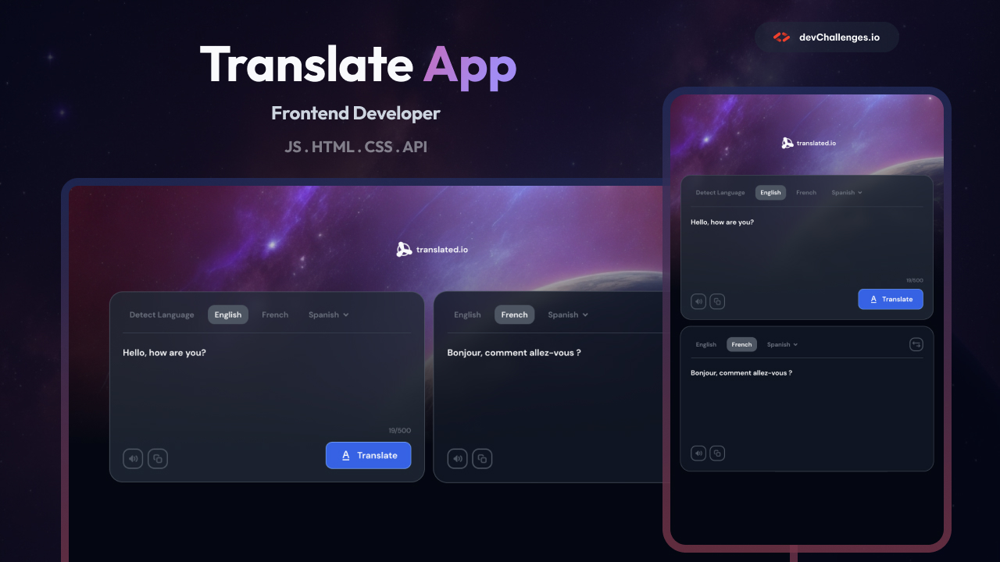

# Translate App



A modern React application that allows users to translate text between languages, listen to both the original and translated text, and copy results easily. Built with React, Vite, and the MyMemory Translation API.

This project was developed in response to the [`Translate App Challenge`](https://devchallenges.io/challenge/translate-app) hosted by [`devChallenges.io`](https://devchallenges.io/), serving as a practical exercise to enhance my coding proficiency through the creation of a real-world application.

## 🔗 Live Demo

👉 [Check out the live demo here!](https://Rola-Al-Ahmad.github.io/Translator)

---

## 🚀 Features

- **Text Translation**: Translate text between multiple languages (including Detect Language, English, Arabic, and French, etc...)
- **Language Detection**: Automatically detect the source language
- **Switch Languages**: Easily swap source and target languages
- **Text-to-Speech**: Listen to both the input and translated text
- **Copy to Clipboard**: Copy translating and translated texts with one click
- **Responsive Design**: Optimized for desktop, tablet, and mobile devices
- **Real-time Updates**: Debounced translation for instant feedback
- **Loading States**: Smooth loading indicators and error handling
- **Modern UI**: Clean, intuitive interface with modern design patterns

## 🛠️ Tech Stack

- **Frontend Framework**: React
- **Build Tool**: Vite
- **HTTP Client**: Fetch API
- **Styling**: CSS
- **Icons & Assets**: SVGs and images in `src/assets/`
- **Code Quality**: ESLint with React-specific rules

## 🚀 Getting Started

### Prerequisites

- Node.js (version 16 or higher)
- npm or yarn package manager

### Installation

1. **Clone the repository**
   ```bash
   git clone <repository-url>
   cd translate-app-master
   ```
2. **Install dependencies**
   ```bash
   npm install
   ```
3. **Start the development server**
   ```bash
   npm run dev
   ```
4. **Open your browser**
   Navigate to `http://localhost:5173` to view the application.

## 📁 Project Structure

```
src/
├── App.jsx                 # Main application component
├── main.jsx                # Application entry point
├── index.css               # Global styles
├── assets/                 # Static assets (images, icons)
├── components/             # Reusable UI components
│   ├── CardAction.jsx
│   ├── CardHeader.jsx
│   ├── CardTextArea.jsx
│   ├── CopyButton.jsx
│   ├── LangButton.jsx
│   ├── LangSelect.jsx
│   ├── SpeakButton.jsx
│   ├── TranslateArea.jsx
│   ├── TranslateButton.jsx
│   └── TranslatorCard.jsx
├── context/                # React Context for global state (e.g. language)
│   └── LanguageContext.jsx
├── hooks/                  # Custom React hooks
│   ├── useClipboard.js
│   ├── useLanguage.js
│   ├── useTextToSpeech.js
│   └── useTranslateText.js
```


## 🔧 Available Scripts

- `npm run dev` - Start development server
- `npm run build` - Build for production
- `npm run preview` - Preview production build
- `npm run lint` - Run ESLint for code quality

## 🌐 API Integration

The application integrates with the [MyMemory Translation API](https://mymemory.translated.net/doc/spec.php) to provide translation functionality.

For text-to-speech features, I use [Puter AI txt2speech](https://docs.puter.com/) to convert text into speech in multiple languages.


